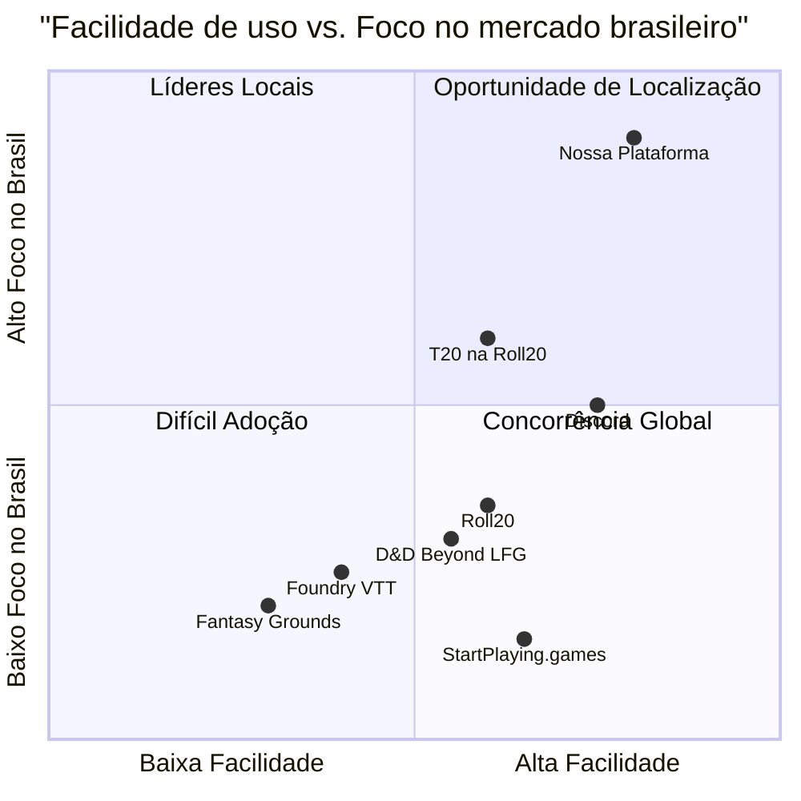

# Documento de Requisitos do Produto - Plataforma de Sessões de RPG

## Resumo Executivo

Este documento detalha os requisitos para uma plataforma de sessões de RPG totalmente localizada em português brasileiro, projetada para simplificar a experiência tanto para jogadores quanto para Mestres. A plataforma enfatizará a descoberta de sessões, construção de comunidade e ferramentas acessíveis para jogabilidade ao vivo, operando em um modelo freemium com dois níveis de preço: Gratuito para Jogadores e R$9,90/mês para Mestres.

## Informações do Projeto

- **Nome do Projeto:** mesa_rpg
- **Idioma:** Português Brasileiro
- **Tecnologias:** React, JavaScript, Tailwind CSS
- **Requisito Original:** Desenvolver uma plataforma de sessões de D&D e outros RPGs totalmente em português brasileiro, que facilite a descoberta de sessões, construção de comunidade e forneça ferramentas acessíveis para jogabilidade ao vivo.

## Definição do Produto

### Metas do Produto

1. **Acessibilidade para RPGistas Brasileiros:** Criar uma plataforma intuitiva e totalmente em português brasileiro que reduza as barreiras de entrada para novos jogadores e mestres.

2. **Centralização da Comunidade RPGista:** Estabelecer um hub central onde jogadores e mestres possam se conectar, encontrar sessões e construir comunidades duradouras em torno de sistemas como D&D e Tormenta20.

3. **Ferramentas de Jogo Simplificadas:** Fornecer um conjunto essencial de ferramentas de jogo em tempo real que complementem (não substituam) VTTs mais robustos, focando na facilitação da narrativa e interação social.

### Histórias de Usuário

1. **Como jogador iniciante**, quero encontrar facilmente sessões marcadas como "amigáveis para iniciantes" para que eu possa começar a jogar RPG sem me sentir intimidado.

2. **Como Mestre experiente**, quero criar e promover minhas sessões pagas para que eu possa monetizar minhas habilidades de narração e construção de mundo.

3. **Como jogador regular**, quero poder filtrar sessões por sistema, horário e estilo de jogo para que eu possa encontrar grupos que se encaixem no meu gosto e disponibilidade.

4. **Como Mestre**, quero ferramentas simples de gerenciamento de campanha para que eu possa organizar notas, mapas e informações de personagens em um só lugar.

5. **Como grupo de jogo**, queremos um diário de campanha compartilhado para que possamos documentar nossa história e consultar informações importantes das sessões anteriores.

### Análise Competitiva

#### Roll20
- **Prós:** Interface baseada em navegador sem necessidade de instalação; grande base de usuários; fichas de personagem para vários sistemas.
- **Contras:** Problemas de desempenho; recursos limitados na versão gratuita; menos automatização; interface pouco intuitiva; foco no mercado internacional.

#### Foundry VTT
- **Prós:** Compra única; altamente personalizável; comunidade de desenvolvimento ativa; ferramentas superiores de mapas e iluminação.
- **Contras:** Configuração técnica mais complexa; módulos podem conflitar entre si; menos polido para jogo baseado em texto.

#### Discord (com bots de RPG)
- **Prós:** Gratuito; facilidade de uso para comunicação; alta acessibilidade; comunidades existentes.
- **Contras:** Sem ferramentas específicas para RPG; necessidade de integrar múltiplos bots; falta de estrutura para encontrar jogos.

#### StartPlaying.games
- **Prós:** Foco em conectar jogadores com mestres; sistema de agendamento integrado; processamento de pagamentos.
- **Contras:** Principalmente em inglês; foco em mestres profissionais; sem ferramentas de jogo integradas.

#### Fantasy Grounds
- **Prós:** Recursos poderosos de automação; plataforma madura; licença Ultimate cobre todos os jogadores.
- **Contras:** Curva de aprendizado acentuada; custo inicial mais alto; necessidade de instalação de software; interface menos intuitiva.

#### LFG do D&D Beyond
- **Prós:** Integrado com ferramentas oficiais de D&D; conexão com fichas de personagem.
- **Contras:** Focado exclusivamente em D&D; sistema menos estruturado; sem ferramentas de jogo integradas.

#### T20 na Roll20
- **Prós:** Suporte oficial para Tormenta20; base crescente de usuários brasileiros.
- **Contras:** Limitações da plataforma Roll20; falta de foco específico para a comunidade brasileira.

### Quadrante Competitivo

## Especificações Técnicas

### Análise de Requisitos

A plataforma Mesa RPG deve atender às necessidades específicas da comunidade brasileira de RPG, oferecendo uma experiência totalmente localizada e com ferramentas que complementem as soluções existentes. A abordagem não é substituir VTTs robustas como Roll20 ou Foundry, mas criar um ecossistema que facilite o encontro entre jogadores e mestres, com ferramentas essenciais para jogabilidade.

O foco principal está em:
1. Descoberta e agendamento de sessões
2. Perfis de usuários e construção de comunidade
3. Ferramentas leves de jogabilidade
4. Monetização para mestres
5. Documentação compartilhada de campanhas

### Pool de Requisitos

#### P0 (Obrigatório)

**Landing Page**
- Sistema de registro e login (email, Google, Facebook)
- Apresentação visual temática de fantasia
- Chamada clara para ação (CTA)
- Apresentação do valor da plataforma
- Exibição de planos de preço

**Lista de Sessões**
- Listagem de sessões disponíveis
- Filtros por sistema (D&D 5e, Tormenta20, etc)
- Filtros por nível de jogador e número de participantes
- Filtros por tags (ex: "amigável para iniciantes", "forte roleplay")
- Filtros por idioma e agenda
- Opções de ordenação (mais populares, mais recentes, etc)

**Criar Sessão**
- Formulário para mestres configurarem novas sessões
- Campos para título, sistema, tags, descrição
- Configuração de vagas para jogadores, faixa de nível
- Definição de status (one-shot ou recorrente)
- Ferramentas de comunicação preferidas
- Pré-visualização da listagem

**Detalhes da Sessão**
- Bio do mestre
- Descrição detalhada da campanha
- Regras da sessão
- Tom (sério/cômico)
- Avisos de conteúdo
- Ferramentas necessárias
- Seção de perguntas e respostas

**Perfil de Usuário**
- Avatar personalizável
- Definição de papel (jogador ou mestre)
- Histórico de sessões
- Avaliações
- Insígnias de conquistas
- Sistemas preferidos

**Interface de Sessão ao Vivo**
- Rolador de dados personalizável
- Visualizador de ficha de personagem (upload de PDF)
- Quadro branco compartilhado ou mapa simples
- Chat em grupo em tempo real
- Integração básica de voz/vídeo
- Notas de sessão e registros compartilhados
- Rastreador de iniciativa
- Referência rápida de regras

**Configurações**
- Preferências gerais (modo escuro, acessibilidade)
- Controles de notificação e privacidade
- Gerenciamento de assinatura e faturamento
- Acesso a tutoriais e suporte

**Vitrine de Mestres**
- Seção dedicada para mestres exibirem sessões
- Construção de seguidores
- Promoção de campanhas pagas
- Avaliações e comentários
- Calendário de disponibilidade

**Diário da Campanha**
- Espaço wiki compartilhado por grupo
- Documentação de lore, NPCs, resumos de sessão
- Funcionalidade de caderno digital
- Suporte à construção de mundo

#### P1 (Deveria Ter)

- Sistema de avaliação para mestres e jogadores
- Notificações de novas sessões compatíveis com preferências
- Integração com calendário para agendamento
- Recursos básicos de acessibilidade (alto contraste, suporte a leitor de tela)
- Sistema de convites para sessões privadas
- Modo de espectador para sessões abertas
- Biblioteca de recursos compartilháveis (mapas, tokens)
- Ferramentas de moderação para comunidade
- Sistema de matchmaking para jogadores

#### P2 (Seria Bom Ter)

- Marketplace para mestres venderem recursos
- Integração com VTTs populares (Roll20, Foundry)
- API para desenvolvedores criarem extensões
- Aplicativo móvel
- Sistema avançado de procura de grupo (LFG)
- Recursos de streaming integrados
- Ferramentas de criação de personagem
- Biblioteca de monstros e NPCs
- Gerador de encontros aleatórios

### Esboço do Design de UI

#### Landing Page
- Cabeçalho com logo e botões de login/registro
- Hero section com imagem temática e pitch principal
- Seção "Como Funciona" com 3 passos ilustrados
- Seção de planos e preços com comparativo
- Depoimentos de usuários
- Seção de recursos destacados com ícones
- Chamada final para ação
- Rodapé com links úteis e redes sociais

#### Lista de Sessões
- Barra lateral com filtros expansíveis
- Cards de sessão com informações essenciais
- Ícones para sistemas e tags
- Indicador de vagas disponíveis
- Botão de inscrição/interesse
- Opções de ordenação no topo

#### Interface de Sessão ao Vivo
- Layout responsivo com painéis redimensionáveis
- Área central para mapa/quadro branco
- Painel lateral para chat e notas
- Barra inferior com rolador de dados e ferramentas
- Area de vídeo/áudio minimizável
- Acesso rápido às fichas de personagem

#### Diário da Campanha
- Estrutura tipo wiki com navegação lateral
- Editor de texto rico com suporte a imagens
- Sistema de tags e categorias
- Histórico de edições
- Opção de visualização pública/privada

### Perguntas em Aberto

1. **Integração com VTTs:** Qual o nível ideal de integração com plataformas como Roll20 e Foundry? Devemos focar em complementar essas ferramentas ou oferecer alternativas simplificadas?

2. **Sistemas Suportados:** Além de D&D 5e e Tormenta20, quais outros sistemas de RPG populares no Brasil devemos priorizar no lançamento?

3. **Hospedagem de Áudio/Vídeo:** Devemos desenvolver nossa própria solução de comunicação por voz/vídeo ou integrar com ferramentas existentes como Discord, Zoom ou solução WebRTC nativa?

4. **Monetização Adicional:** Além da assinatura para mestres, quais outras fontes de receita poderíamos explorar sem comprometer a experiência do usuário?

5. **Escalabilidade:** Como garantir que a plataforma suporte um grande número de sessões simultâneas sem degradação de performance, especialmente considerando recursos como áudio/vídeo e compartilhamento de mapas?

## Apêndices

### Persona 1: João - O Mestre Experiente
- **Idade:** 32 anos
- **Ocupação:** Professor universitário
- **Experiência com RPG:** 15 anos como mestre de D&D e Tormenta
- **Necessidades:** Monetizar suas habilidades de narração, encontrar jogadores comprometidos, ferramentas para organizar campanhas longas
- **Frustrações:** Dificuldade em cobrar por sessões, jogadores que abandonam campanhas, tempo gasto organizando materiais em diferentes plataformas

### Persona 2: Ana - A Jogadora Iniciante
- **Idade:** 19 anos
- **Ocupação:** Estudante universitária
- **Experiência com RPG:** Assistiu streams de RPG mas nunca jogou
- **Necessidades:** Encontrar grupos amigáveis para iniciantes, aprender regras básicas, experimentar diferentes sistemas
- **Frustrações:** Intimidação por grupos experientes, confusão com termos técnicos, dificuldade em encontrar mesas em horários compatíveis

### Persona 3: Carlos - O Jogador Veterano
- **Idade:** 28 anos
- **Ocupação:** Desenvolvedor de software
- **Experiência com RPG:** 10 anos como jogador em diversos sistemas
- **Necessidades:** Encontrar campanhas com narrativas elaboradas, conectar-se com outros jogadores experientes, ferramentas que não interrompam o fluxo do jogo
- **Frustrações:** Sessões canceladas de última hora, mestres inexperientes, ferramentas complexas que atrapalham a imersão

### Fluxos de Usuário

#### Fluxo 1: Jogador encontra e se inscreve em uma sessão
1. Usuário se registra/faz login
2. Navega para a Lista de Sessões
3. Aplica filtros relevantes (sistema, horário, nível)
4. Explora cards de sessões e seleciona uma de interesse
5. Visualiza página de Detalhes da Sessão
6. Clica em "Candidatar-se"
7. Preenche questionário breve do mestre (se solicitado)
8. Recebe notificação de aprovação
9. Acessa sessão no horário agendado

#### Fluxo 2: Mestre cria e gerencia uma sessão
1. Mestre se registra/faz login
2. Assina plano para mestres
3. Navega para "Criar Sessão"
4. Preenche detalhes da campanha e configurações
5. Visualiza prévia e publica sessão
6. Recebe notificações de candidaturas
7. Revisa perfis e aprova/rejeita jogadores
8. Envia mensagens pré-sessão com informações
9. Inicia sessão no horário agendado

#### Fluxo 3: Grupo utiliza o Diário da Campanha
1. Mestre cria novo Diário ao iniciar campanha
2. Convida jogadores aprovados para colaborar
3. Após sessão, mestre adiciona resumo dos eventos
4. Jogadores contribuem com notas sobre seus personagens
5. Mestre adiciona entradas sobre NPCs e locais importantes
6. Jogadores consultam diário antes da próxima sessão
7. Grupo continua expandindo o diário ao longo da campanha

### Métricas de Sucesso

1. **Crescimento de Usuários:**
   - Número de novos registros por mês
   - Taxa de conversão de visitantes para registros
   - Retenção de usuários após 30/60/90 dias

2. **Engajamento:**
   - Número de sessões criadas por mês
   - Taxa de preenchimento das sessões
   - Tempo médio gasto na plataforma
   - Frequência de uso do diário de campanha

3. **Monetização:**
   - Taxa de conversão para assinatura de mestres
   - Duração média das assinaturas
   - Receita mensal recorrente (MRR)

4. **Satisfação:**
   - Net Promoter Score (NPS)
   - Avaliações de sessões (para jogadores e mestres)
   - Taxa de conclusão de campanhas

### Roteiro de Lançamento

1. **Fase Alpha (2 meses)**
   - Desenvolvimento das funcionalidades P0
   - Testes internos e correção de bugs
   - Recrutamento de grupo fechado de testadores

2. **Fase Beta (3 meses)**
   - Lançamento para grupo limitado de testadores
   - Implementação de feedback inicial
   - Desenvolvimento das funcionalidades P1
   - Melhorias de UX baseadas em testes de usuário

3. **Lançamento Público (1 mês)**
   - Campanha de marketing nas comunidades de RPG brasileiras
   - Parcerias com criadores de conteúdo de RPG
   - Eventos de lançamento virtual
   - Programa de indicação para primeiros usuários

4. **Pós-Lançamento (6 meses)**
   - Coleta contínua de feedback
   - Implementação de funcionalidades P2
   - Expansão para sistemas adicionais
   - Desenvolvimento de recursos solicitados pelos usuários
